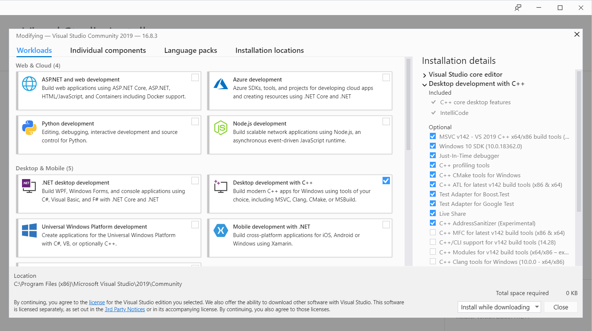
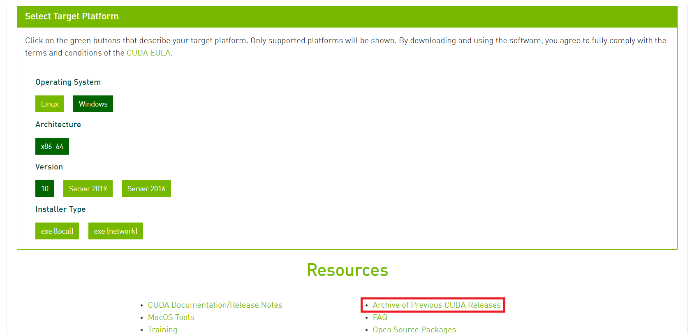
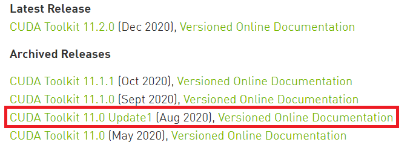
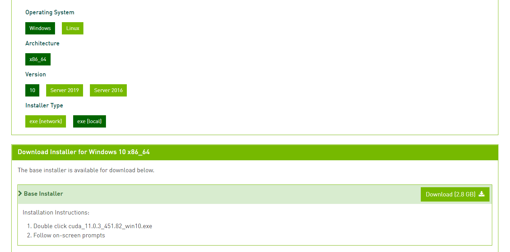
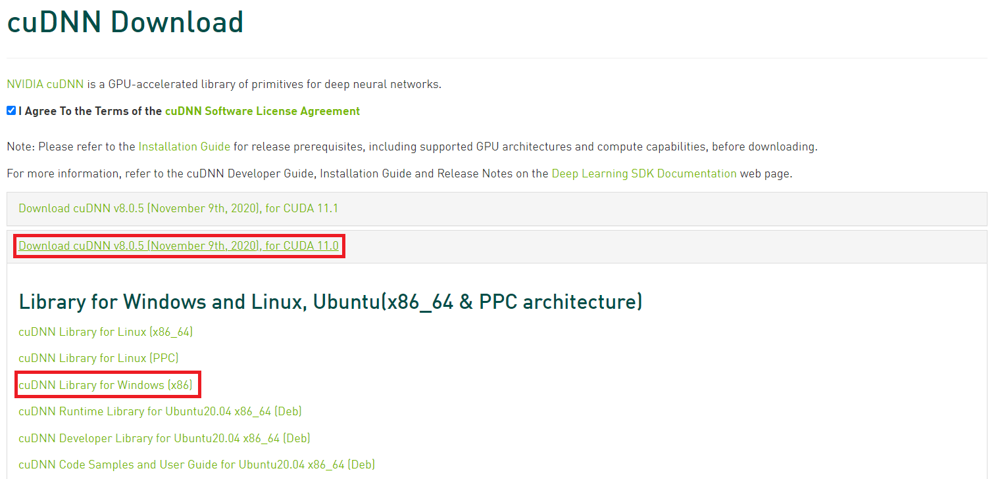
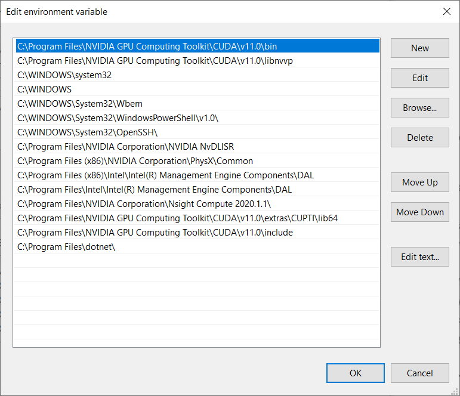
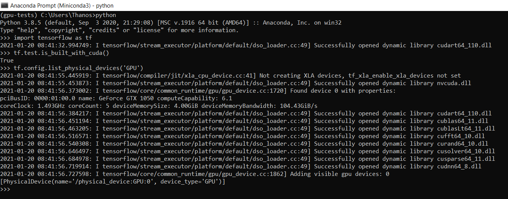
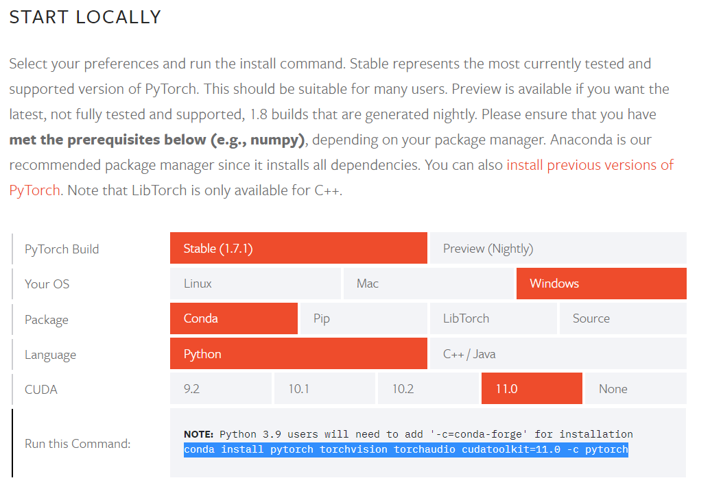

# Setting up GPU capability on Windows and Linux (January 2021)

Setting up the GPU capability on Windows or Linux for deep learning (using TensorFlow or PyTorch) is often not very obvious.

Following the documentation created by NVIDIA (https://docs.nvidia.com/deeplearning/cudnn/install-guide/index.html) is not obvious and I have not managed to make it work directly from there.

Instead, I took inspiration from [here](https://medium.com/swlh/cuda-installation-in-windows-2020-638b008b4639) and [here](https://towardsdatascience.com/installing-tensorflow-with-cuda-cudnn-and-gpu-support-on-windows-10-60693e46e781).

The following will allow for generic installation of the required drivers and packages for TensorFlow, as PyTorch tends to included cuDNN in the package installation available in Conda.

## Generic requirements

For installing TensorFlow with GPU, you can check the requirements on [tensorflow.org/install/gpu](https://www.tensorflow.org/install/gpu). It is important to check the tested build configurations for [Windows](https://www.tensorflow.org/install/source_windows) and [Linux](https://www.tensorflow.org/install/source#linux) since this gives the compatibility matrix of a TensorFlow version with the respective CUDA and CuDNN versions.

Compatibility matrix for Windows:

![Compatibility matrix for Windows][comp_linux]

[comp_linux]: images/compatibility_windows.PNG "Compatibility matrix for Windows"

Compatibility matrix for Linux:

![Compatibility matrix for Linux][comp_linux]

[comp_linux]: images/compatibility_linux.PNG "Compatibility matrix for Linux"

For both Windows and Linux, CUDA and cuDNN need to be installed.

### CUDA

From [Wikipedia](https://en.wikipedia.org/wiki/CUDA): *__CUDA__ (Compute Unified Device Architecture) is a parallel computing platform and application programming interface (API) model created by Nvidia. It allows software developers and software engineers to use a CUDA-enabled graphics processing unit (GPU) for general purpose processing – an approach termed GPGPU (General-Purpose computing on Graphics Processing Units).*

CUDA allows to harness the power of the GPU to run specific operations in a faster and more efficient way than the CPU.

To install CUDA, you need to have a [CUDA-enabled GPU card](https://developer.nvidia.com/cuda-GPUs).

### cuDNN

From the [NVIDIA](https://developer.nvidia.com/CUDNN) website: *The NVIDIA CUDA Deep Neural Network library (cuDNN) is a GPU-accelerated library of primitives for Deep Neural Networks. It provides highly tuned implementations for standard routines such as forward and backward convolution, pooling, normalization, and activation layers.*

*Deep learning researchers and framework developers worldwide rely on cuDNN for high-performance GPU acceleration. It allows them to focus on training neural networks and developing software applications rather than spending time on low-level GPU performance tuning. cuDNN accelerates widely used deep learning frameworks, including Caffe2, Chainer, Keras, MATLAB, MxNet, PyTorch, and TensorFlow.*

## Installation on Windows

For Windows, the process requires the following steps:
1. Visual Studio installation
2. CUDA installation
3. CuDNN installation
4. Testing and verification (here Miniconda is used)

### 1. Visual Studio installation
As a first step, Visual Studio needs to be installed as it will install the components required for running Visual C++. The community edition of Visual Studio 2019 can be downloaded from [here](https://visualstudio.microsoft.com/vs/community/). As a bonus, we also get the Visual Studio IDE, but I am not currently using that.

Once the installer is downloaded it, start it up and it will start installing the Visual Studio Installer. From there,  select the *Desktop environment with C++* and install it. 



The installation is large and tends to take some time so go ahead and grab some water as we cannot proceed until this is done. CUDA has a requirement for Visual Studio so the CUDA installation will not be complete unless Visual Studio is installed. A reboot will be required at the end. 

### 2. CUDA Installation

The CUDA installer can be found [here](https://developer.nvidia.com/cuda-downloads?target_os=Windows&target_arch=x86_64&target_version=10). Since the latest version will not do (11.2 at the time of writing) based on the compatibility tables above, we need to go the archive and download version 11.0. We can directly access the CUDA archive from [here](https://developer.nvidia.com/cuda-toolkit-archive)



You can select the Aug 2020 Update 1 version and download the local installer for Windows 10.





Once the download has been completed, run the installer and follow the instructions for the *Express Installation*.

Once this is finished, then we need to install the specific library for deep learning, cuDNN.

### cuDNN installation
For downloading cuDNN, you need to create a developer account with NVIDIA. This can be done by going [here](https://developer.nvidia.com/cudnn-download-survey).

Once you have created your account, donwload the appropriate version based on the CUDA version and the compatibility matrix (here, version 8.0.5 for CUDA 11.0).



Once the download is complete, follow the process below to install cuDNN:

1. Extract the resulting zip file
2. Go to the CUDA installation directory. It should be at *C:\Program Files\NVIDIA GPU Computing Toolkit\CUDA\v11.0*
3. Copy the following files to the CUDA installation directory:
   1. Copy _extracted-zip-path\cuda\bin\cudnn*.dll_ to *C:\Program Files\NVIDIA GPU Computing Toolkit\CUDA\v11.0\bin*
   2. Copy _extracted-zip-path\cuda\include\cudnn*.h_ to *C:\Program Files\NVIDIA GPU Computing Toolkit\CUDA\v11.0\include*
   3. Copy _extracted-zip-path\cuda\lib\x64\cudnn*.lib_ to *C:\Program Files\NVIDIA GPU Computing Toolkit\CUDA\v11.0\lib\x64*

### Final checks and verification
Make sure that the PATH environment variable is set up correctly as shown in the image below (look for the NVIDIA ones):


Finally, let's check that the installation works well and the GPU capability is available.

For this purpose, I will use a [Miniconda](https://docs.conda.io/en/latest/miniconda.html) installation to create and start a virtual environment for testing.

```python
conda create -n gpu-tests python=3.8
conda activate gpu-tests
```

Once the environment has been created, we can install tensorflow:
```python
pip install tensorflow
```

Once the installation is completed, you can test if tensorflow can be used with the GPU by starting python and running:
```python
import tensorflow as tf
tf.test.is_built_with_cuda()
tf.config.list_physical_devices('GPU')
```

The output should resemble the following where the first command returns **True** and the second returns a list with the GPU devices available.



For PyTorch, you can check what should be the command used to install it by going [here](https://pytorch.org/get-started/locally/):



In the same environment as above, copy the command and run it:

```python
conda install pytorch torchvision torchaudio cudatoolkit=11.0 -c pytorch
```

This will take some time as some large files need to be downloaded.

Once the installation is done, start python again and run:
```python
import torch
torch.cuda.is_available()
```

The response should be **True**.

Congratulations! Now you can run deep learning algorithms on your computer's GPU on Windows 10!

## Installation on Linux (Ubuntu 20.04)

Installing on Linux tends to be harder mostly due to the quality of the NVIDIA drivers. However, I have found it to be straightfoward by following the instructions on tensorflow.org/install/gpu and by installing CUDA with apt.

The instructions available in the above page are for Ubuntu 18.04 but it is relatively straightforward to modify the commands for Ubuntu 20.04.

By following the below instructions, you should be able to install the NVIDIA drivers, CUDA and cuDNN on Ubuntu 20.04:

```bash
# Add NVIDIA package repositories
$ wget https://developer.download.nvidia.com/compute/cuda/repos/ubuntu2004/x86_64/cuda-ubuntu2004.pin
$ sudo mv cuda-ubuntu2004.pin /etc/apt/preferences.d/cuda-repository-pin-600
$ sudo apt-key adv --fetch-keys https://developer.download.nvidia.com/compute/cuda/repos/ubuntu2004/x86_64/7fa2af80.pub
$ sudo add-apt-repository "deb https://developer.download.nvidia.com/compute/cuda/repos/ubuntu2004/x86_64/ /"
$ sudo apt-get update

$ wget http://developer.download.nvidia.com/compute/machine-learning/repos/ubuntu2004/x86_64/nvidia-machine-learning-repo-ubuntu2004_1.0.0-1_amd64.deb

$ sudo apt install ./nvidia-machine-learning-repo-ubuntu2004_1.0.0-1_amd64.deb
$ sudo apt-get update

# Install NVIDIA driver
$ sudo apt-get install --no-install-recommends nvidia-driver-460
# Reboot. Check that GPUs are visible using the command: nvidia-smi

$ wget https://developer.download.nvidia.com/compute/machine-learning/repos/ubuntu2004/x86_64/libnccl2_2.8.3-1+cuda11.0_amd64.deb
$ sudo apt install ./libnccl2_2.8.3-1+cuda11.0_amd64.deb
$ sudo apt-get update

# Install development and runtime libraries (~4GB)
$ sudo apt-get install --no-install-recommends \
    cuda-11-0 \
    libcudnn8=8.0.4.30-1+cuda11.0  \
    libcudnn8-dev=8.0.4.30-1+cuda11.0
```

Once this is done, you can follow the guide for Windows on [testing and verification](#Final-checks-and-verification). You can disregard the information on the environment variables, these should have been set up correctly during the installation.

Congratulations! You can now use the GPU for deep learning tasks!
